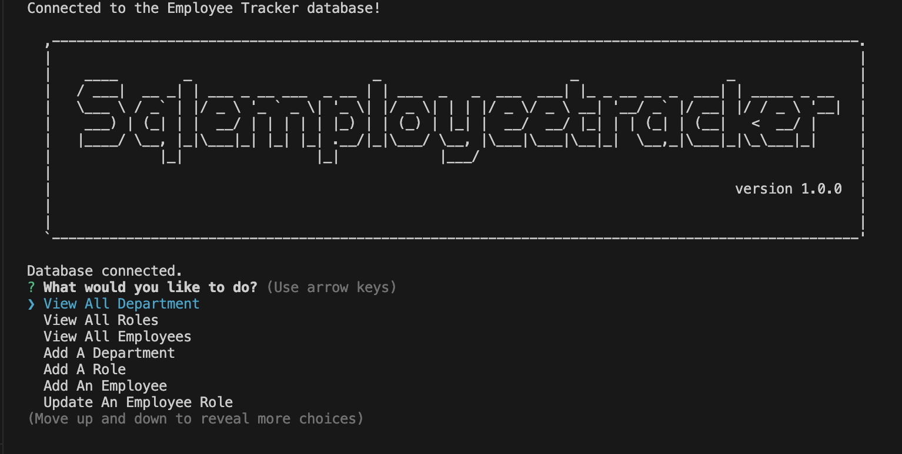

# SQLemployeeTracker

## Description

This project was created for companies to keep employees information stored in a database where it can udpated as needed.
Creating this project was a challenge in terms of learning how to use inquirer and databases to interact with each other.
I've learned how databases work and to use the CRUD methods for getting this employee tracker to work together.

## Installation

Clone this repo into your computer and in your command line, install the following:
- npm i inquirer@8.2.4 (inquirer)
- npm install pg (postgres)
- OPTIONAL: npm install asciiart-logo

## Usage

In the CLI, run;

- psql -U postgres, login, and create database by using "\i db/schema.sql"

- "node index.js" to start the inquirer prompt and use as needed!

GITHUB REPO: https://github.com/2023kgl/SQLemployeeTracker

WALKTHROUGH VIDEO: https://drive.google.com/file/d/1TNQnn9D6k-9UYAOBFNO4lNerOxZ4VDmj/view?usp=sharing

 

## Credits

Bootcamp TA's

